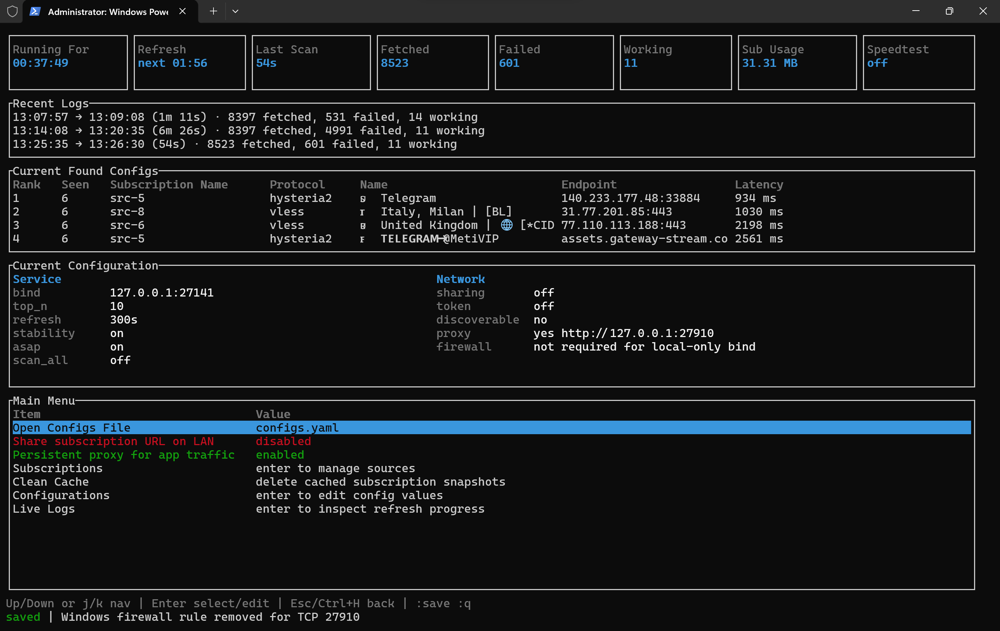

<p align="center">
  <a href="https://deepwiki.com/411A/V2RayDAR">
    
  </a>
</p>

<p align="center">
  <strong>🌐 Available in</strong><br>
  <strong><a href="README.md">English</a></strong>
  • <strong><a href="docs/README.fa.md">فارسی</a></strong>
  • <strong><a href="docs/README.zh-CN.md">简体中文</a></strong>
  • <strong><a href="docs/README.ru.md">Русский</a></strong>
  • <strong><a href="docs/README.fr.md">Français</a></strong>
</p>

<p align="center">
  
</p>

<h1 align="center">V2RayDAR</h1>

<p align="center">
  <em>V2Ray Detection And Reconnaissance — pronounced like <code>v2ray</code> + <code>radar</code>.</em>
</p>

<p align="center">
  A fast Rust CLI/TUI that fetches V2Ray / Clash / Mihomo subscription sources, validates them through your real network with <code>sing-box</code>, ranks the configs that actually work, and re-publishes the best ones at a local subscription URL your v2rayN / v2rayNG / sing-box / Clash Verge / Mihomo client can point to.
</p>

<p align="center">
  📘 <a href="docs/guide.md">Read the detailed developer guide</a>
</p>

## 🖥️ Windows TUI Preview

<p align="center">
  
</p>

## 🤔 Why V2RayDAR

- Pulls subscriptions in parallel from any number of sources you list.
- Parses raw, base64, JSON, and YAML feeds — and `vmess`, `vless`, `trojan`, `ss`, `ssr`, `hysteria2`, `hy2`, `tuic` share-links.
- **Parses Clash/Mihomo YAML configs** — add a Mihomo subscription URL and V2RayDAR extracts all proxy entries automatically.
- **Bidirectional format conversion** — converts between V2Ray share-links and Clash/Mihomo YAML proxy entries.
- Validates each candidate through your current network with `sing-box` (it actually loads a test URL through the proxy).
- **Dual-format output** — serves working configs as V2Ray share-links (`/subscription`) **and** as full Mihomo YAML configs (`/mihomo.yaml`), so any client can use them.
- Re-exposes the top working configs at a local URL so any compatible client just sees one always-fresh subscription.
- **Persistent HTTP/SOCKS5 proxy** — keeps a `sing-box` process running with the best config, exposing a local proxy port any app can use. Enable `proxy.enabled` in `configs.yaml` and point Telegram, browsers, or any app at `127.0.0.1:27910`.
- **LAN proxy sharing** — set `proxy.discoverable: true` to bind `0.0.0.0` and add firewall rules, so every phone on your Wi-Fi can use the proxy. Telegram one-tap setup: `https://t.me/socks?server=192.168.1.2&port=27910`.
- Survives restricted networks via previously-probed configs in the database, an in-network bridge config, or an `emergency_config`.
- Optional LAN sharing with optional token protection, so the phone in your pocket can use the same feed.

## 📦 Quick Install

Copy the command for your OS into a terminal. The installer detects your platform, downloads the latest release with bundled `sing-box`, and sets everything up. Portable mode installs into `Desktop/V2RayDAR` when a Desktop folder exists, otherwise `~/V2RayDAR`. User mode installs the binary to `~/.local/bin`.

**Portable** (recommended) — everything in one folder, run with `--portable`:
```bash
# Linux
curl -fsSL https://raw.githubusercontent.com/411A/V2RayDAR/main/install.sh | sh

# macOS
curl -fsSL https://raw.githubusercontent.com/411A/V2RayDAR/main/install.sh | sh

# Windows
irm https://raw.githubusercontent.com/411A/V2RayDAR/main/install.ps1 | iex
```

**User install** — binary to `~/.local/bin`, data in home:
```bash
# Linux / macOS
curl -fsSL https://raw.githubusercontent.com/411A/V2RayDAR/main/install.sh | sh -s -- --user

# Windows
irm https://raw.githubusercontent.com/411A/V2RayDAR/main/install.ps1 | iex
# Then choose option 2 when prompted
```

**Android / Termux:**
```bash
# Install sing-box, then run the installer
pkg update -y && pkg install -y curl tar sing-box=1.13.13
curl -fsSL https://raw.githubusercontent.com/411A/V2RayDAR/main/install.sh | sh
# Always use --no-tui on Termux (TUI mouse input doesn't work in Termux terminals)
cd V2RayDAR && ./v2raydar --no-tui
```

**Manual download** — grab the archive for your OS from [Releases](https://github.com/411A/V2RayDAR/releases/latest) and run with `--portable`.

The installer verifies SHA-256 checksums, detects existing installations and offers to update (preserving `configs.yaml`, `data.db`, and `v2raydar_data/`), and never requires sudo by default.

## 🔰 Quick start

After installing with the script above, run `v2raydar` (or `v2raydar.exe` on Windows). On first launch it creates a `configs.yaml` with a set of pre-selected subscription sources to get you started.

1. **Wait for it to populate.** The app fetches your subscription sources in parallel, probes each config through your real network, and ranks the ones that work. The endpoint is live from the start — your client can point to it immediately.
2. **Point your client** at the subscription URL:

| Client | Endpoint |
| --- | --- |
| v2rayN / v2rayNG | `http://127.0.0.1:27141/subscription` (base64) |
| sing-box | `http://127.0.0.1:27141/subscription.txt` (plain) |
| Clash Verge / Mihomo | `http://127.0.0.1:27141/mihomo.yaml` |

3. **TUI controls:**

| Key | Action |
| --- | --- |
| `↑` / `↓` or `j` / `k` | Navigate |
| `Enter` | Select / toggle / confirm |
| `Esc` / `Ctrl+H` | Go back |
| `Space` | Toggle subscription on/off |
| `e` | Edit selected subscription |
| `q` | Quit |
| `:` | Command mode — `:q` quit, `:w` save, `:a` add, `:d` delete, `:n` rename, `:u` URL, `:p` priority |

4. **Change settings** from the TUI main menu (Configurations) or edit `configs.yaml` directly — changes take effect on the next refresh. Key settings: `top_n`, `refresh_seconds`, `sharing.enabled`, `probe.mode`.
5. **Exit** with `q` or `:q`. The endpoint stops when the app exits.

### Run modes

```bash
v2raydar                # TUI + local subscription endpoint
v2raydar --no-tui       # headless — endpoint and logs only
v2raydar --once         # refresh once, print results, exit
v2raydar --portable     # keep all data next to the executable
v2raydar --uninstall    # remove app data and owned firewall rules
```

Windows users replace `v2raydar` with `v2raydar.exe`. On macOS open the bundled `.app` once and Gatekeeper will remember it.

## ⚙️ Default config at a glance

<details>
  <summary>👣 <strong>configs.yaml</strong> — table of every key, default, and what it does. Full explanations live in the <a href="docs/guide.md">detailed guide</a>.</summary>

| Key | Default | Purpose |
| --- | --- | --- |
| `bind` | `127.0.0.1:27141` | Local HTTP bind address for `/subscription`, `/subscription.txt`, `/results`, and `/health`. |
| `top_n` | `10` | Number of working configs published to clients. |
| `refresh_seconds` | `300` | Auto-refresh interval in seconds; `0` disables the timer. |
| `encoded_subscription` | `true` | Returns `/subscription` as base64 (v2rayN / v2rayNG friendly). |
| `prioritize_stability` | `true` | Re-pings the previous run's saved top-N first and keeps them at the front, even if new low-ping configs appear. When `false`, prefers any working low-ping config. |
| `return_configs_asap` | `false` | When `true`, publishes working configs to the endpoint and `Current Found Configs` as soon as they are found, up to `top_n`; early configs may not have the lowest ping or best stability. |
| `scan_all_configs` | `false` | When `true`, validates every loaded config instead of stopping after enough have been confirmed. |
| `fetch_timeout_ms` | `30000` | Per-source fetch timeout. |
| `fetch_concurrency` | `8` | Subscription sources fetched in parallel. |
| `max_subscription_bytes` | `33554432` | Size cap per fetched subscription source (32 MiB). |
| `use_cache_only` | `false` | When `true`, skip fresh fetches and load previously-probed configs from the database — useful on heavily restricted networks. |
| `emergency_config` | `null` | Optional working share-link used through `sing-box` as a bridge when HTTP subscription fetches fail. |
| `clean_offlines_after_days` | `7` | Days after which unreachable configs are removed from the database. |
| `sharing.enabled` | `false` | Lets LAN clients read the endpoints. |
| `sharing.require_token` | `false` | Requires `?token=...` for LAN requests. |
| `sharing.token` | `null` | Leave empty, set `true` to auto-generate, or supply a string. |
| `proxy.enabled` | `false` | Starts a persistent `sing-box` process exposing a mixed SOCKS5/HTTP proxy. |
| `proxy.port` | `27910` | Port for the mixed SOCKS5/HTTP proxy. |
| `proxy.discoverable` | `false` | Binds to `0.0.0.0` and adds a firewall rule for LAN access. |
| `proxy.health_check_url` | `https://www.gstatic.com/generate_204` | URL tested through the proxy to verify it's alive. |
| `proxy.health_check_interval_seconds` | `60` | Seconds between proxy health checks. Auto-failover on failure. |
| `probe.mode` | `active` | `active` uses `sing-box`; `tcp` is diagnostic only. |
| `probe.sing_box_path` | `null` | Optional path to `sing-box`. Leave `null` for desktop `_with_singbox` builds or Termux's package path. |
| `probe.connect_timeout_ms` | `5000` | TCP connect timeout for diagnostic probing. |
| `probe.active_timeout_ms` | `30000` | HTTP test timeout in active mode. |
| `probe.startup_timeout_ms` | `5000` | Wait time for the temporary proxy to come up. |
| `probe.concurrency` | `16` | Base active-probing concurrency. |
| `probe.batch_size` | `20` | Initial active-probing batch size. |
| `probe.process_concurrency` | `null` | `sing-box` batch processes allowed at once; auto-scales when empty. |
| `probe.test_url` | `https://www.gstatic.com/generate_204` | URL loaded through each candidate. |
| `probe.accepted_statuses` | `[204, 200]` | HTTP statuses counted as success. |
| `probe.download_url` | `null` | Optional throughput-test target. |
| `probe.download_bytes_limit` | `1048576` | Upper bound for the optional download test. |
| `geoip_db_path` | `null` | Optional path to a `GeoLite2-Country.mmdb` file. If `null`, uses the embedded database for country detection. |
| `subscriptions` | _(pre-selected sources)_ | List of `{ name, url, enabled, priority }` sources. Add your own for better results. |

</details>

## 🌐 Notes for restricted networks

- If you are on a very restricted network, previously-probed configs are stored in the database and can be used via `use_cache_only: true`.
- By default, if some HTTP subscription URLs don't connect on your network but one config is reachable, the app uses that config to retry those failed HTTP subscriptions too. And if there are no working configs on your network but you have one working config yourself, you can bring it into `configs.yaml`'s `emergency_config` so the app uses it to retry failed HTTP subscription fetches.

## 📡 Pointing common clients at V2RayDAR

- **v2rayN (same PC)** — keep `bind: 127.0.0.1:27141` and add `http://127.0.0.1:27141/subscription` as a subscription URL.
- **v2rayNG / phone on the same Wi-Fi** — bind to the PC's LAN IP (e.g. `192.168.1.23:27141`), turn on `sharing.enabled`, then use `http://192.168.1.23:27141/subscription` on the phone. Visit `/health` from the phone first to confirm reachability.

Full client walkthroughs, token-protected sharing, and OS-specific firewall details are in the [detailed guide](docs/guide.md).

### 📱 Persistent proxy for app traffic

V2RayDAR can run a persistent SOCKS5/HTTP proxy alongside the subscription endpoint. Any app on the system — Telegram, browsers, curl, Python — can route traffic through it without a separate VPN client.

**Enable in `configs.yaml`:**
```yaml
proxy:
  enabled: true
  port: 27910
  discoverable: false   # true = LAN access + firewall rule
```

**Local usage (on the device running V2RayDAR):**
```bash
# SOCKS5
curl --socks5 127.0.0.1:27910 https://api.ipify.org

# HTTP
curl --proxy http://127.0.0.1:27910 https://api.ipify.org
```

**LAN usage (phone on same Wi-Fi):**
1. Set `proxy.discoverable: true` — V2RayDAR adds a firewall rule and binds to `0.0.0.0`.
2. Find your PC's LAN IP in the TUI's **Current Configuration** panel under **Network** (or run `ipconfig` / `ip addr`). For example `192.168.1.2`.
3. **Telegram:** replace `YOUR_LAN_IP` with your actual LAN IP and open this URL on your phone:

   ```
   https://t.me/socks?server=YOUR_LAN_IP&port=27910
   ```

   For example, if your LAN IP is `192.168.1.2`:
   ```
   https://t.me/socks?server=192.168.1.2&port=27910
   ```

   Or manually: Telegram → Settings → Data and Storage → Proxy Settings → Add Proxy:
   - Type: **SOCKS5** or **HTTP**
   - Host: `YOUR_LAN_IP` (the IP shown in V2RayDAR's TUI panel)
   - Port: `27910`

4. **System-wide on Android:** Settings → WiFi → long-press your network → Modify → Advanced → Proxy → Manual → Server: `YOUR_LAN_IP`, Port: `27910`.

The proxy auto-failovers to the next best config when the current one fails, and switches to a better config on each refresh cycle.

## 🤝 Contributing

Contributions are welcome! Feel free to open an Issue for bugs, feature requests, questions, or suggestions, or submit a Pull Request. Any feedback is greatly appreciated.

## 🗺 Roadmap

- [ ] Add a cross-platform GUI app beside the TUI using Tauri.
- [ ] Extract V2Ray configs from the body of any website — preferably from non-JS-heavy sites, with FireCrawl or Obscura as a fallback for the JS-heavy ones.
- [ ] Private endpoints with password requirements and authentication: when a subscription endpoint is private and password-protected, users can get their private endpoint that fetches the configs through a national reachable endpoint that has internet access.

## 👨‍💻 Warranty and responsibility

The app is published as-is, without any warranty.

The developer will not, by itself, create or distribute V2Ray-compatible configs, and is not responsible for the V2Ray subscriptions the user scans and connects to. The owner of the V2Ray server you connect to may be able to intercept your traffic and read your unencrypted data.

## ☕️ Contact & Donations

### 💬 Contact

<p align="center">
<a href="https://t.me/TechKrakenBot">
  
</a>
</p>

### 💎 Donate via TON

If you find this project helpful, you can support its development through donations on the TON blockchain:

```
ton://transfer/TechKraken.ton
```

```
UQCGk4IU5nm6dYWjXTx6vSQVOtKO4LQg3m8cRcq1eQo7vhCl
```
